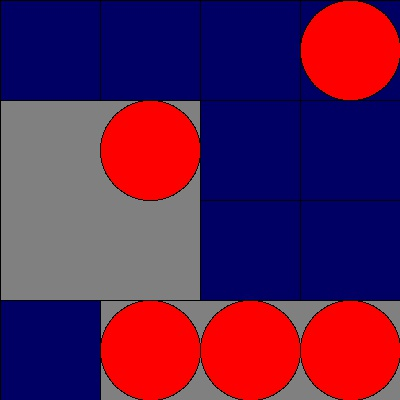
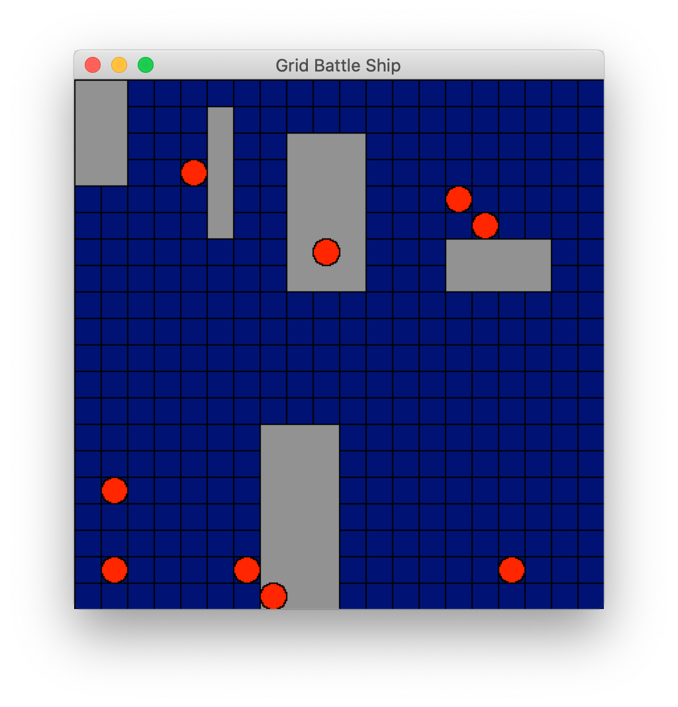

# grid-battle-ship
A little game of battle ship. An exercise of tk GUI and pillow image-processing.

## usage example
### 1. input from argument and make image
* command
```
 >python src/main.py -i "4-1B 2C,2D 4D-2B 2D 3D 4D 4A"
```
* result
```
{'sunk': 1, 'alive': 1, 'intact': 0}
```
* saved image file "grid_battle_ship.jpg"


### 2. input from json file and display preview
* command
```
 >python src/main.py -pj code.json
```
* result
```
{'sunk': 0, 'alive': 2, 'intact': 3}
```
* window for preview image

